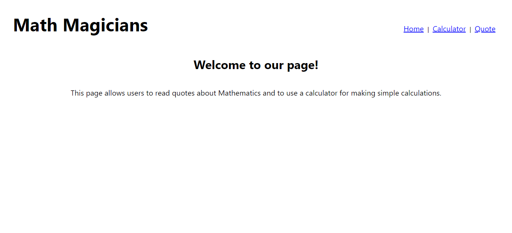
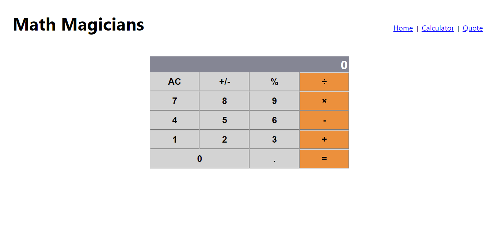
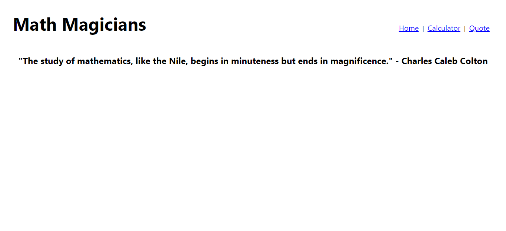

# Math Magicians

> In this project I use React and JSX to design a single-page application that allows users to use a calculator and to read quotes about mathematics.





## Built With

- React
- JavaScript
- HTML
- CSS

## Live Demo

To view a live demo on Heroku, click [here](https://math-magicians-yuvrajm108.herokuapp.com/).

To view a live demo on Netlify, click [here](https://hungry-mcnulty-b1cbdd.netlify.app/).

## Getting Started

### Prerequisites

- Install a code editor(VSCode or Atom will do the trick)
- Install NodeJS
- Install Git Bash

### Setup

- In a folder of your choice, clone this repo using ```git clone https://github.com/YuvrajM108/math-magicians.git``` in your git bash.
- ```cd JavaScript-Capstone``` and then ```code .``` or ```atom .``` depending on your editor to open the project

### Install

- In your integrated command line, ```npm install``` to install all node dependencies

### Usage

- In your integrated command line, ```npm start``` will launch the website on your default browser.

## Authors

👤 **Yuvraj Manoo**

- GitHub: [@YuvrajjM108](https://github.com/YuvrajM108)
- Twitter: [@YuvrajM108](https://twitter.com/YuvrajM108)
- LinkedIn: [Yuvraj-Manoo](https://linkedin.com/in/yuvraj-manoo)

## 🤝 Contributing

Contributions, issues, and feature requests are welcome!

## Show your support

Give a ⭐️ if you like this project!

## 📝 License

This project is [MIT](./MIT.md) licensed.
